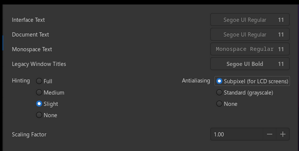

# Font
INstall font di windows 11

git clone https://github.com/mrbvrz/segoe-ui-linux
Font installed on '/home/alessandro/.local/share/fonts/Microsoft/TrueType/SegoeUI/'

# Font Originali:

Interface Text -> Cantarell Regular -> 11
Document Text -> Cantarell Regular -> 11
Monospace Text -> Monospace Regular -> 11
Legacy Windows Titles -> Cantarell Bold -> 11
Hinting -> Slight
Antialiasing -> Standard (grayscale)

